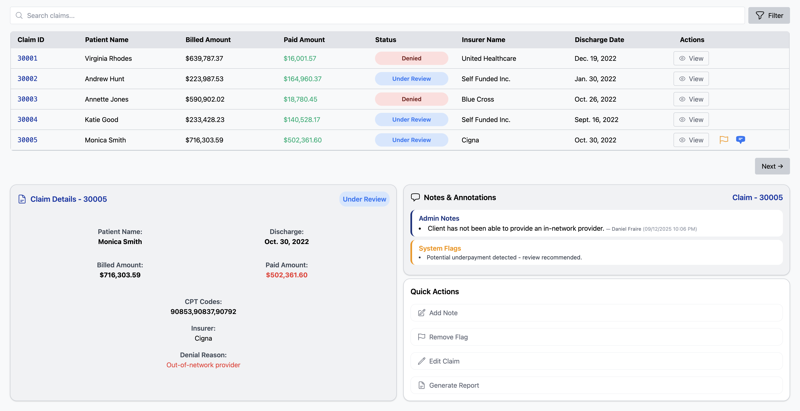

# Claim Management System

This Django webapp allows for JSON/CSV data ingestion into a SQLite database via a management command to display all claims with ID, patient name, billed amount, paid amount, status, and insurer name. It also allows for claim-specific information such as CPT codes, denial reasons, notes, and flags to be displayed without full page reload. Users can flag claims for review, add custom notes stored in the SQLite database, and can also use the search and filter functionality by name, id, billed amount, paid amount, claim status and insurer name. The webapp includes a registration and login page, supports JSON/CSV data overwrite and appending, and generates a admin dashboard displaying number of claims, percentage that is paid/denied, number of flags, average underpayment, and graphs displaying the ratios between paid/denied/under review claims, and how they are distributed among the insurers. 

### Built With

[![Django][DjangoBadge]][Django]
[![Python][PythonBadge]][Python]
[![Alpine.js][Alpine.jsBadge]][Alpine.js]
[![HTMX][HTMXBadge]][HTMX]
[![SQLite][SQLiteBadge]][SQLite]
[![Tailwind CSS][TailwindCSSBadge]][Tailwind CSS]
[![Git][GitBadge]][Git]


---

## Table of Contents

- [Installation](#installation)
- [Usage](#usage)
- [Management Commands](#management-commands)
- [Features](#features)
- [Requirements](#requirements)
- [Contributing](#contributing)
- [License](#license)
- [Contact](#contact)
- [Acknowledgements](#acknowledgements)

---

## Installation 

1. **Install Python**  
Download Python 3.13+ from [Python], or using your preffered package manager.
    

2. **Clone Repository**

```bash
git clone https://github.com/Fraire209/erisa-challenge.git
cd erisa-challenge
```

3. **Create a virtual environment**

```bash
python3 -m venv venv
```
4. **Activate virtual environment** 
 
MacOS/Linux
```bash
source venv/bin/activate
```

Git Bash, WSL
```bash
source venv/Scripts/activate 
```
PowerShell
```bash
venv\Scripts\Activate.ps1
```
Command Prompt
```bash
venv\Scripts\activate.bat
```
5. **Install Django**

```bash
pip install -r requirements.txt
```

6. **Apply migrations**

```bash
python manage.py migrate
```
7. **Load JSON/CSV files through management command**

```bash
python manage.py load_claims
```
8. **Run server**

```bash
python manage.py runserver
```

---

## Usage 

Once you have completed the installation steps, the webapp is able to be used through the Django development server accessed using the following link:

```
http://127.0.0.1:8000/
```
Upon loading the webapp, you will be directed to a login page, on initial use the user will have to sign up. To create an account, enter your first name, last name, username and a password. Then you will be prompted to go back to the login screen to sign in.


Once signed in, you will enter the home view, showing a logout button, a search bar and filter button, a paginated table showing claims in the order of ingestion, a claim detail dashboard, a notes an annotations panel and a quick actions panel.


The table rows display the claim details, with an additional "View" button. This button displays the claim details with additional information such as CPT codes, insurer, and denial reason in the bottom left claim details panel. 

When clicking a specific claims view button, the notes and annotations button is swapped with that claim's notes and flags, if any. You are also able to add a user specific note, flag the claim, edit the claim, or generate a report with overall statistics of the data currently in the database. 



When you add a note, the name of the user that is logged in along with a timestamp will be attached and displayed next to the note. Adding a note or a flag also dynamically updates the respective table row using HTMX to add a flag or a comment icon, making it easier to identify claims witht these attributes. When a flag is set, the flag button is also dynamically updated into a remove flag button, allowing you to remove the flag at your discretion. 

The edit claim button allows you to overwrite any of the attributes displayed on the table, but it also allows you to either overwrite or to append information for the CPT codes or denial reason sections. 


If you dont want to make any changes to the CPT codes or denial reason, you may leave those sections empty, else you inout your data and select whether to overwrite or append that information to the respective attributes. All other sections are required to submit the form, and will overwrite that attribute by default. 

The generate report button shows you statistics of the data currently in the table, alongside pie graphs showing the division of claims by insurer, and by claim status. To regenerate the report, simply click the generate report button again. 


You are also able to search claims by typing a claim number, a name, a date, a billed/pay amount, status or insurer. The table will dynamically update to show claims that have attributes containing those parameters.


You can also set filter options, filtering by either insurer or claim status. The filter button opens up a dropdown menu with selectors for each field.


You can also use the search bar in combination with the filters to create an even more powerful search. 

---
## Management Commands

The web app also includes two management command tools. The first one is used during installation being "load_claims" This management command reads the data from the files stored in the data folder of the project and ingests them into their respective database tables according to the defined models. 

Load data from files into the database using 

```bash
python manage.py load_claims
```
A success message will print if valid files (JSON/CSV) are found, else a file not found message will print. 


A second management command named "clear_table" can be used to manually clear any table created by the program and to reset the automated pk incrementation.

Tables that can be deleted are
* Claim
* ClaimDetail
* Note
* SystemFlag

Claim and ClaimDetail tables can be restored by running the load_claims management command. 

Delete the contents of a table by using 

```bash
python manage.py clear_table claims.[Table_Name]
```
A success message will print telling you the name of the deleted table and confirming the auto-increment was reset


---
## Features

* User Authentication
* Search and Filtering
* Flagging
* Annotating 
* Editing
* Create, Read, Update
* Support for multiple file formats
* Easy installation of [Django] via pip
* Dynamic content loading using [HTMX] to avoid full reloads
* Interactive UI elements with [Alpine.js] for dropdowns and toggles
* Lightweight [SQLite] database with no setup required
* Responsive UI styled with [Tailwind CSS]

---
## Requirements 

### Backend
* Python 3.13+
* Django 5.2.5
* SQLite (default) - no setup

### Frontend (loaded via CDN in 'claims/base.html' and 'claims/login_base.html')
* [Tailwind CSS 2.2.19](https://cdn.jsdelivr.net/npm/tailwindcss@2.2.19/dist/tailwind.min.css)  
* [htmx 1.9.10](https://unpkg.com/htmx.org@1.9.10)  
* [Alpine.js 3.x](https://unpkg.com/alpinejs@3.x.x/dist/cdn.min.js)  
* [Chart.js](https://cdn.jsdelivr.net/npm/chart.js)  

### Development Tools
* pip (Python package manager)
* Virtual environment tool (`venv`)

---
## Contributing 

For setup instructions, view [Installation](#installation).

For any suggestions, please fork the repository and create a pull request. Thanks!
1. Fork the Project
2. Create your Feature Branch `git checkout -b feature/feature-name`
3. Commit your Changes `git commit -m 'Add feature'`
4. Push to the Branch `git push origin feature/feature-name`
5. Open a Pull Request

---
## License

This project is for personal use and not licensed for public distribution.

---
## Contact

Daniel Fraire - fraire209@icloud.com - [LinkedIn]

Project Link - https://github.com/Fraire209/insurance-claim-django-webapp

---
## Acknowledgements 

* [Tailwind CSS Documentation](https://tailwindcss.com/docs/styling-with-utility-classes)
* [HTMX Documentation](https://htmx.org/docs/)
* [Alpine.js Documentation](https://alpinejs.dev/start-here)
* [Django Documentation](https://docs.djangoproject.com/en/5.2/topics/http/views/)
* [W3Schools JS HTML DOM](https://www.w3schools.com/js/js_htmldom_eventlistener.asp)
* [heroicons](https://heroicons.com/outline)
* [Wordpress Markdown Documentation](https://wordpress.com/support/markdown-quick-reference/)
* [geeksforgeeks Django Documentation](https://www.geeksforgeeks.org/python/django-tutorial/)
* [Github Mardown Badges](https://github.com/Ileriayo/markdown-badges)

<!-- MARKDOWN LINKS & IMAGES -->
[Django]: https://www.djangoproject.com/
[HTMX]: https://htmx.org/
[Alpine.js]: https://alpinejs.dev/
[SQLite]: https://sqlite.org/
[Tailwind CSS]: https://tailwindcss.com/
[Python]: https://www.python.org/
[Git]: https://git-scm.com/
[LinkedIn]: https://linkedin.com/in/fraire-daniel
[SQLiteBadge]: https://img.shields.io/badge/sqlite-%2307405e.svg?style=for-the-badge&logo=sqlite&logoColor=white
[Chart.jsBadge]: https://img.shields.io/badge/chart.js-F5788D.svg?style=for-the-badge&logo=chart.js&logoColor=white
[DjangoBadge]: https://img.shields.io/badge/django-%23092E20.svg?style=for-the-badge&logo=django&logoColor=white
[Alpine.jsBadge]: https://img.shields.io/badge/alpinejs-white.svg?style=for-the-badge&logo=alpinedotjs&logoColor=%238BC0D0
[TailwindCSSBadge]: https://img.shields.io/badge/tailwindcss-%2338B2AC.svg?style=for-the-badge&logo=tailwind-css&logoColor=white
[HTMLBadge]: https://img.shields.io/badge/html5-%23E34F26.svg?style=for-the-badge&logo=html5&logoColor=white
[HTMXBadge]: https://img.shields.io/badge/HTMX-%2302569B.svg?style=for-the-badge&logo=htmx&logoColor=white
[PythonBadge]: https://img.shields.io/badge/python-3670A0?style=for-the-badge&logo=python&logoColor=ffdd54
[GitBadge]: https://img.shields.io/badge/git-%23F05033.svg?style=for-the-badge&logo=git&logoColor=white
[LinkedInBadge]: https://img.shields.io/badge/linkedin-%230077B5.svg?style=for-the-badge&logo=linkedin&logoColor=white